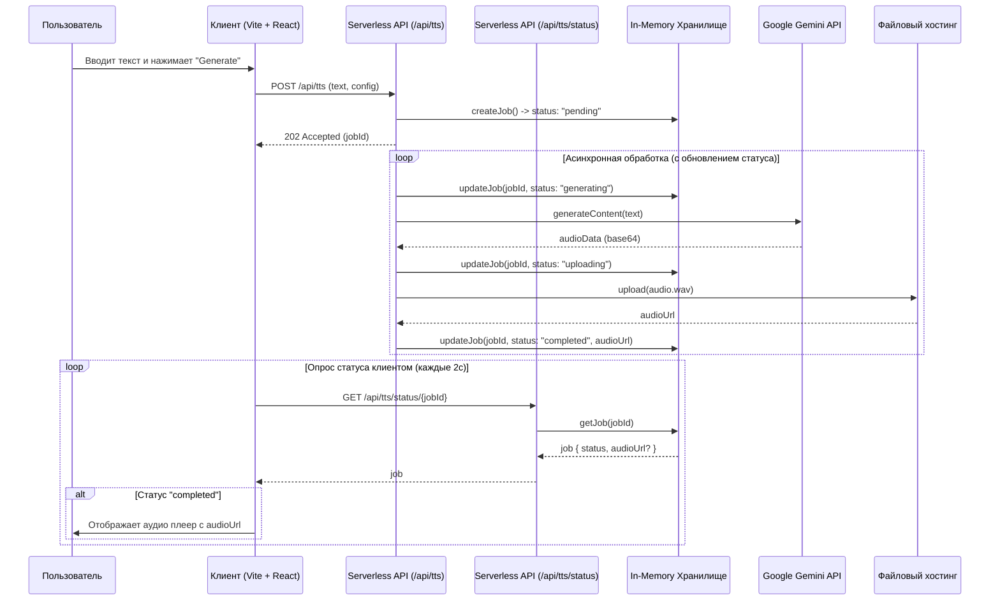

# План разработки: Text-to-Speech приложение (Версия 2.0)

## 1. Итоговая архитектура

Мы создадим веб-приложение со следующей архитектурой:

*   **Структура:** Монорепозиторий под управлением `Yarn Workspaces`.
*   **Фронтенд:** Одностраничное приложение (SPA), созданное с помощью **Vite**, **React** и библиотеки компонентов **MUI**.
*   **Бэкенд:** Набор **бессерверных (Serverless) функций**, написанных на TypeScript.
*   **Хранилище задач:** Временное **in-memory хранилище** для отслеживания статуса задач.

## 2. Структура проекта (Монорепозиторий)

```
/tts-xonika
├── package.json             # Главный package.json для Yarn Workspaces
├── /apps
│   └── /frontend            # Vite + React + MUI приложение
│       ├── package.json
│       ├── vite.config.ts
│       └── /src
├── /packages
│   ├── /api                 # Код для бессерверных функций (бэкенд)
│   │   ├── package.json
│   │   └── /src
│   │       ├── tts.ts       # Логика создания задачи
│   │       └── status.ts    # Логика проверки статуса
│   ├── /job-store           # Наш in-memory модуль для хранения задач
│   │   ├── package.json
│   │   └── index.ts
│   └── /shared-types        # Общие TypeScript типы для API
│       ├── package.json
│       └── index.ts
└── vercel.json              # Конфигурация для развертывания на Vercel (пример)
```

## 3. Визуализация архитектуры и взаимодействия



## 4. Модель данных и Статусы (`packages/shared-types`)

*   **`Job.status`**: (`"pending"` | `"generating"` | `"uploading"` | `"completed"` | `"failed"`)
    *   `pending`: Задача создана и ожидает обработки.
    *   `generating`: Идет обращение к Gemini API для синтеза речи.
    *   `uploading`: Полученные аудиоданные загружаются в облачное хранилище.
    *   `completed`: Задача успешно выполнена, аудиофайл доступен.
    *   `failed`: На одном из этапов произошла ошибка.

## 5. Описание пользовательского интерфейса (UI)

Интерфейс будет состоять из следующих блоков, реализованных с помощью MUI:

1.  **Блок выбора модели (Model Selection):**
    *   Позволяет выбрать между "Gemini 2.5 Flash" и "Gemini 2.5 Pro".

2.  **Блок режима синтеза (Speech Mode):**
    *   Переключатель между "Single Speaker" и "Multi Speaker".

3.  **Блок конфигурации голоса (Voice Configuration):**
    *   **Single Speaker:** Один выпадающий список для выбора голоса.
    *   **Multi Speaker:** Динамический список с полями "Speaker Name", выбором голоса и кнопкой удаления для каждого спикера. Кнопка "Add Speaker" для добавления новых.

4.  **Блок текста для преобразования (Text to Convert):**
    *   Многострочное поле для ввода текста с динамической подсказкой в зависимости от режима.

5.  **Кнопка генерации (Generate Speech):**
    *   Запускает процесс. Будет менять свое состояние (текст и активность), отражая текущий статус задачи (`Generating...`, `Uploading...`).

6.  **Блок сгенерированного аудио (Generated Audio):**
    *   Появляется после успешного завершения. Содержит аудиоплеер и кнопку "Download".

## 6. План реализации по шагам

1.  **Настройка окружения:** Инициализировать монорепозиторий `Yarn Workspaces` и создать пакеты `apps/frontend`, `packages/api`, `packages/job-store`, `packages/shared-types`.
2.  **Разработка общих модулей:** Реализовать `shared-types` и `job-store`.
3.  **Разработка Бэкенда:** Создать бессерверные функции для `POST /api/tts` и `GET /api/tts/status/:jobId` с логикой обновления статусов.
4.  **Разработка Фронтенда:** Настроить MUI, создать UI-компоненты согласно описанию и реализовать клиентскую логику с опросом статуса.
---

## 7. Стратегия развертывания (Deployment)

### Рекомендуемая платформа: Vercel

Для развертывания как фронтенд-приложения, так и бэкенда на бессерверных функциях, мы будем использовать платформу **Vercel**.

**Преимущества:**
*   **Нативная поддержка:** Vercel идеально подходит для развертывания проектов на Vite/React и бессерверных API.
*   **Простота (CI/CD из коробки):** Развертывание происходит автоматически при каждом `git push` в основную ветку репозитория.
*   **Работа с монорепозиториями:** Платформа без дополнительной сложной настройки распознает структуру нашего монорепозитория с `Yarn Workspaces`.

### Процесс настройки и работы:
1.  **Подключение репозитория:** Проект на Vercel подключается к вашему Git-репозиторию (GitHub, GitLab, Bitbucket).
2.  **Конфигурация:** С помощью файла `vercel.json` в корне проекта мы укажем Vercel:
    *   Где находится корневая директория фронтенд-приложения (`apps/frontend`).
    *   Где находятся бессерверные функции (`packages/api/src`).
3.  **Автоматическое развертывание:** При каждом обновлении кода Vercel будет автоматически:
    *   Устанавливать все зависимости.
    *   Собирать статическую часть фронтенда.
    *   Развертывать каждый `.ts` файл из папки с API как отдельный эндпоинт. Например, `packages/api/src/tts.ts` станет доступен по URL `https://<your-app>.vercel.app/api/tts`.